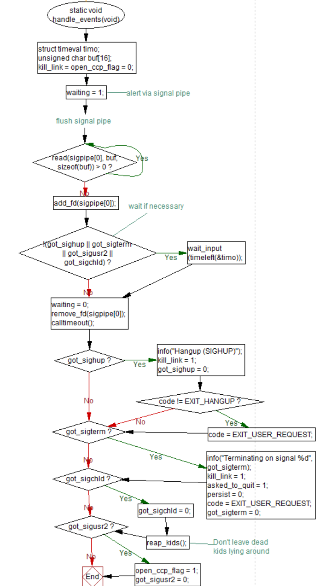
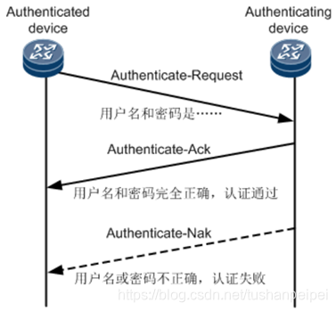
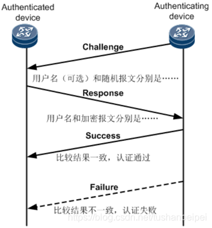

# PPP代码阅读与分析

## 1 笔者序  
本实验涉及了对两种不同环境中PPP（Point-to-Point Protocol）协议实现的分析：独立的开源项目和Linux内核。开源项目，如在GitHub上托管的代码库，提供了一个完整的pppd守护进程实现，该守护进程负责PPP连接的建立、配置、测试和拆除。这些项目通常包括对多种认证协议的支持，如PAP、CHAP和EAP，以及对IPCP等网络层协议的支持，用于动态IP地址分配。此外，这些实现还包括插件和扩展机制，允许开发者集成额外的功能，例如新的认证方法、数据压缩和加密技术。

与此相对的是Linux内核中的PPP实现，它作为内核模块被集成到操作系统的核心中。这种实现方式使得PPP协议能够直接与串行设备和网络接口卡等硬件设备交互，并且与Linux网络堆栈紧密集成，从而优化性能和减少上下文切换。内核实现还包括特定于内核的配置选项，允许在编译内核时启用或禁用PPP支持，并确保与ip、ifconfig、pppdump等内核网络工具的兼容性。

本文着重讲述了笔者认为较为重要的几个文件，其中包括pppd的`main.c`、`chap.c`文件，以及Linux内核中的`ppp_generic.c`、`ppp_async.c`文件。若有理解不周之处，敬请指正。  
## 2 pppd中的main.c
### 2.1 概述  
`main.c` 是 PPP 守护进程（pppd）的主模块，负责初始化、配置和管理 PPP 连接的生命周期。  
### 2.2 main 函数  
#### 2.2.1 概述  
`main`函数为PPP守护进程的入口点，负责初始化PPP环境、解析命令行参数、设置信号处理、启动PPP连接等。它的运行过程是PPP守护进程工作流程的核心。  
#### 2.2.2 代码分析  
1. **初始化阶段**  
程序首先设置路径变量，如`path_upapfile`等，这些是PPP协议相关文件的路径。  
	```C
	strlcpy(path_upapfile, PPP_PATH_UPAPFILE, MAXPATHLEN);
	strlcpy(path_chapfile, PPP_PATH_CHAPFILE, MAXPATHLEN);

	strlcpy(path_net_init, PPP_PATH_NET_INIT, MAXPATHLEN);
	strlcpy(path_net_preup, PPP_PATH_NET_PREUP, MAXPATHLEN);
	strlcpy(path_net_down, PPP_PATH_NET_DOWN, MAXPATHLEN);

	strlcpy(path_ipup, PPP_PATH_IPUP, MAXPATHLEN);
	strlcpy(path_ipdown, PPP_PATH_IPDOWN, MAXPATHLEN);
	strlcpy(path_ippreup, PPP_PATH_IPPREUP, MAXPATHLEN);
	```
	接着，设置日志设施和密码库。  
	```C
	/* Initialize syslog facilities */
	reopen_log();

	/* Initialize crypto libraries */
	if (!PPP_crypto_init())
	{
		exit(1);
	}
	```
	然后，获取主机名。  
	```C
	if (gethostname(hostname, sizeof(hostname)) < 0)
	{
		ppp_option_error("Couldn't get hostname: %m");
		exit(1);
	}
	hostname[MAXNAMELEN - 1] = 0;
	```
	最后，设置文件权限掩码（umask），防止创建权限过宽的文件。  
	```C
	umask(umask(0777) | 022);
	```
	至此，初始化阶段结束。  
2. **用户权限和组**  
首先，检查当前用户ID（uid），并确定是否有特权（即是否为root用户）。  
	```C
	uid = getuid();
	privileged = uid == 0;
	slprintf(numbuf, sizeof(numbuf), "%d", uid);
	ppp_script_setenv("ORIG_UID", numbuf, 0);
	```
	然后，获取用户所属的组。  
	```C
	ngroups = getgroups(NGROUPS_MAX, groups);
	```
3. **协议初始化**  
首先初始化一个 magic number 生成器，用于在协议中生成随机数。  
	```C
	magic_init(); // 初始化 magic number 生成器
	```
	接着，初始化支持的每一个PPP协议。 
	```C
	for (i = 0; (protp = protocols[i]) != NULL; ++i)
		(*protp->init)(0); // 初始化每个PPP协议
	```
	然后，初始化默认通道。
	```C
	tty_init(); // 初始化默认通道
	```

4. **设备和选项处理**  
首先，依次解析系统选择文件、用户选项文件和命令行参数。  
	```C
	if (!ppp_options_from_file(PPP_PATH_SYSOPTIONS, !privileged, 0, 1)
		|| !options_from_user()
		|| !parse_args(argc-1, argv+1))
		exit(EXIT_OPTION_ERROR); // 解析系统和用户选项文件以及命令行参数
	```

	然后，确保设备名称已经指定，并且解析tty的选项文件。  
	```C
	if (the_channel->process_extra_options)
		(*the_channel->process_extra_options)();
	```

5. **日志和调试**  
如果启用了调试模式，设置日志掩码以记录更详细的信息。  
	```C
	if (debug)
		setlogmask(LOG_UPTO(LOG_DEBUG)); // 设置日志掩码
	```

	如果需要，显示选项并退出。
	```C
	if (show_options) {
		showopts();
		die(0);
	}
	```

6. **权限检查**  
确保程序以root用户身份运行，因为PPP守护进程需要高级权限来配置网络接口。  
	```C
	if (geteuid() != 0) {
		ppp_option_error("must be root to run %s, since it is not setuid-root", argv[0]);
		exit(EXIT_NOT_ROOT);
	}
	```


7. **内核支持检查**  
检查内核是否支持PPP。  
	```C
	if (!ppp_check_kernel_support()) {
		ppp_option_error("%s", no_ppp_msg);
		exit(EXIT_NO_KERNEL_SUPPORT);
	}
	```


8. **选项验证**  
验证给定的选项是否有效且一致。  
	```C
	check_options();
	if (!sys_check_options())
		exit(EXIT_OPTION_ERROR);
	auth_check_options();
	mp_check_options();
	for (i = 0; (protp = protocols[i]) != NULL; ++i)
		if (protp->check_options != NULL)
			(*protp->check_options)();
	if (the_channel->check_options)
		(*the_channel->check_options)();
	```


9. **文件描述符和信号处理**  
确保文件描述符0、1、2是打开的，并且指向某个地方（通常是/dev/null）。  
	```C
	fd_devnull = open(PPP_DEVNULL, O_RDWR); // 确保文件描述符0, 1, 2是打开的
	```


	设置信号处理。
	```C
	setup_signals(); // 设置信号处理
	```

10. **数据库和会话管理**  
如果支持，打开PPP数据库并更新条目。  
	```C
	#ifdef PPP_WITH_TDB
	pppdb = tdb_open(PPP_PATH_PPPDB, 0, 0, O_RDWR|O_CREAT, 0644);
	if (pppdb != NULL) {
		slprintf(db_key, sizeof(db_key), "pppd%d", getpid());
		update_db_entry();
	} else {
		warn("Warning: couldn't open ppp database %s", PPP_PATH_PPPDB);
		if (multilink) {
			warn("Warning: disabling multilink");
			multilink = 0;
		}
	}
	#endif
	```


11. **处理按需拨号**  
如果是按需拨号，设置接口。  
	```C
	if (demand)
	{
		/*
		* Open the loopback channel and set it up to be the ppp interface.
		*/
		fd_loop = open_ppp_loopback();
		set_ifunit(1);
		/*
		* Configure the interface and mark it up, etc.
		*/
		demand_conf();
	}
	```


12. **主循环**  
主循环部分主要负责处理事件，获取输入，启动或关闭连接等。  
	```C
	for (;;) {
		// 重置一些状态变量
		bundle_eof = 0;
		bundle_terminating = 0;
		listen_time = 0;
		need_holdoff = 1;
		devfd = -1;
		code = EXIT_OK;
		++unsuccess;
		doing_callback = do_callback;
		do_callback = 0;

		// 如果是按需拨号模式，等待网络活动
		if (demand && !doing_callback) {
			new_phase(PHASE_DORMANT);
			demand_unblock();
			add_fd(fd_loop);
			for (;;) {
				handle_events();
				if (asked_to_quit)
					break;
				if (get_loop_output())
					break;
			}
			remove_fd(fd_loop);
			if (asked_to_quit)
				break;

			// 准备建立连接
			demand_block();
			info("Starting link");
		}

		// 记录开始时间，并清除之前的连接时间和数据量统计
		ppp_get_time(&start_time);
		ppp_script_unsetenv("CONNECT_TIME");
		ppp_script_unsetenv("BYTES_SENT");
		ppp_script_unsetenv("BYTES_RCVD");

		// 开始 LCP 协议以建立连接
		lcp_open(0);        
		start_link(0);
		while (phase != PHASE_DEAD) {
			handle_events();
			get_input();
			if (kill_link)
				lcp_close(0, "User request");
			if (asked_to_quit) {
				bundle_terminating = 1;
				if (phase == PHASE_MASTER)
					mp_bundle_terminated();
			}
			if (open_ccp_flag) {
				if (phase == PHASE_NETWORK || phase == PHASE_RUNNING) {
					ccp_fsm[0].flags = OPT_RESTART; /* clears OPT_SILENT */
					(*ccp_protent.open)(0);
				}
			}
		}
		// 恢复 FSMs 到原始状态
		lcp_close(0, "");

		// 如果不持久连接，或者用户请求退出，或者达到最大失败次数，则退出循环
		if (!persist || asked_to_quit || (maxfail > 0 && unsuccess >= maxfail))
			break;

		// 如果是按需拨号模式，丢弃当前连接
		if (demand)
			demand_discard();
		t = need_holdoff? holdoff: 0;
		if (holdoff_hook)
			t = (*holdoff_hook)();
		if (t > 0) {
			new_phase(PHASE_HOLDOFF);
			TIMEOUT(holdoff_end, NULL, t);
			do {
				handle_events();
				if (kill_link)
					new_phase(PHASE_DORMANT); /* 允许信号结束等待 */
			} while (phase == PHASE_HOLDOFF);
			if (!persist)
				break;
		}
	}
	```
	下面对上述代码中的主要步骤说明：
	- **重置状态变量：**
	在每次循环开始时，重置一些状态变量，如 bundle_eof、bundle_terminating、listen_time、need_holdoff、devfd、code、unsuccess、doing_callback 和 do_callback。

	- **按需拨号模式处理：**
	如果是按需拨号模式（demand），则等待网络活动。调用 new_phase(PHASE_DORMANT) 进入休眠阶段。解锁按需拨号（demand_unblock()）并添加循环回接口的文件描述符（add_fd(fd_loop)）。循环等待事件或循环回接口输出，如果用户请求退出或有输出，则退出循环。移除循环回接口的文件描述符（remove_fd(fd_loop)）。如果用户请求退出，则退出主循环。
	准备建立连接，调用 demand_block() 和 info("Starting link")。
	-  **记录开始时间和清除统计数据：**
		- 记录连接开始时间（ppp_get_time(&start_time)）。
		- 清除之前的连接时间和数据量统计（ppp_script_unsetenv）。
	- **开始 LCP 协议：**
		- 调用 lcp_open(0) 开始 LCP 协议以建立连接。
		- 调用 start_link(0) 开始连接过程。
	- **主循环处理连接：**
		- 在 phase 不等于 PHASE_DEAD 的循环中，处理事件（handle_events()）、获取输入（get_input()）。
		- 如果用户请求断开连接（kill_link），则关闭 LCP 协议（lcp_close(0, "User request")）。
		- 如果用户请求退出（asked_to_quit），则设置 bundle_terminating 并根据需要终止多链路捆绑（mp_bundle_terminated()）。
		- 如果启用了 CCP 协议（open_ccp_flag），则根据当前阶段启动 CCP 协议（ccp_fsm[0].flags = OPT_RESTART; (*ccp_protent.open)(0)）。
	- **恢复 FSMs 到原始状态：**
	调用 lcp_close(0, "") 恢复 FSMs 到原始状态。
	- **检查退出条件：**
	如果不持久连接（!persist）、用户请求退出（asked_to_quit）或达到最大失败次数（maxfail > 0 && unsuccess >= maxfail），则退出主循环。
	- **按需拨号模式的连接丢弃：**
	如果是按需拨号模式（demand），则丢弃当前连接（demand_discard()）。
	- **等待阶段处理：**
根据需要等待（holdoff）或使用自定义等待钩子（holdoff_hook）。如果需要等待，则进入等待阶段（new_phase(PHASE_HOLDOFF)）并设置超时（TIMEOUT(holdoff_end, NULL, t)）。在等待阶段循环处理事件，如果用户请求断开连接，则进入休眠阶段（new_phase(PHASE_DORMANT)）。如果完成等待或不持久连接，则退出主循环。
13. **清理和退出**  
	```C
	PPP_crypto_deinit(); // 清理密码学库
	die(code);
	```

### 2.3 handle_events函数  
`handle_events`函数是事件驱动编程的一部分，它处理信号和超时事件，并对不同的信号做出相应的响应，如终止链接、清理子进程等。
`handle_events`主要包括以下几个重要过程：  
1. **初始化和准备：**
   - 定义一个`timeval`结构体`timo`用于设置超时。
   - 定义一个缓冲区`buf`用于读取信号管道的数据。
   - 初始化`kill_link`和`open_ccp_flag`标志位为0。

2. **信号管道处理：**
   - 设置`waiting`标志为1，表示开始等待信号。
   - 清空信号管道，确保没有旧的信号残留。
   - 将信号管道的读端添加到文件描述符集合中，以便等待其数据。

3. **等待输入或超时：**
   - 如果没有收到特定的信号（SIGHUP、SIGTERM、SIGUSR2、SIGCHLD），则调用`wait_input`函数等待输入或超时。

4. **文件描述符管理：**
   - 从文件描述符集合中移除信号管道的读端。

5. **超时检查：**
   - 调用`calltimeout`函数检查是否有超时事件需要处理。

6. **信号响应：**
   - **SIGHUP**：如果收到SIGHUP信号，记录挂起事件，设置`kill_link`为1，重置`got_sighup`标志位，如果`code`不是`EXIT_HANGUP`，则设置为`EXIT_USER_REQUEST`。
   - **SIGTERM**：如果收到SIGTERM信号，记录终止事件，设置`kill_link`为1，设置`asked_to_quit`和`persist`，设置退出码为`EXIT_USER_REQUEST`，重置`got_sigterm`标志位。
   - **SIGCHLD**：如果收到SIGCHLD信号，重置`got_sigchld`标志位，并调用`reap_kids`函数清理已终止的子进程。
   - **SIGUSR2**：如果收到SIGUSR2信号，设置`open_ccp_flag`为1，重置`got_sigusr2`标志位。

7. **结束等待：**
   - 设置`waiting`标志为0，表示结束等待信号。

	详细的代码注释如下：  
	```C
	/*
	* handle_events - 等待某些事情发生并对其进行响应。
	*/
	static void
	handle_events(void)
	{
		// 定义一个timeval结构体，用于设置超时时间
		struct timeval timo;
		// 定义一个缓冲区，用于读取信号管道的数据
		unsigned char buf[16];

		// 初始化kill_link和open_ccp_flag标志位
		kill_link = open_ccp_flag = 0;

		// 通过信号管道发送警报
		waiting = 1;
		// 清空信号管道，确保没有旧的信号残留
		for (; read(sigpipe[0], buf, sizeof(buf)) > 0;)
			;
		// 将信号管道的读端添加到文件描述符集合中，以便可以等待其数据
		add_fd(sigpipe[0]);
		// 如果没有收到SIGHUP、SIGTERM、SIGUSR2或SIGCHLD信号，则等待输入或超时
		if (!(got_sighup || got_sigterm || got_sigusr2 || got_sigchld))
			wait_input(timeleft(&timo));
		waiting = 0;
		// 从文件描述符集合中移除信号管道的读端
		remove_fd(sigpipe[0]);

		// 调用timeout处理函数，检查是否有超时事件需要处理
		calltimeout();
		// 如果收到SIGHUP信号
		if (got_sighup)
		{
			// 输出信息，表示挂起（SIGHUP）
			info("Hangup (SIGHUP)");
			// 设置kill_link标志位，表示需要终止链接
			kill_link = 1;
			// 重置got_sighup标志位
			got_sighup = 0;
			// 如果code不是EXIT_HANGUP，则设置为EXIT_USER_REQUEST
			if (code != EXIT_HANGUP)
				code = EXIT_USER_REQUEST;
		}
		// 如果收到SIGTERM信号
		if (got_sigterm)
		{
			// 输出信息，表示正在终止，参数是收到的信号编号
			info("Terminating on signal %d", got_sigterm);
			// 设置kill_link标志位，表示需要终止链接
			kill_link = 1;
			// 设置asked_to_quit标志位，表示用户请求退出
			asked_to_quit = 1;
			// 设置persist为0，表示不再保持连接
			persist = 0;
			// 设置退出码为EXIT_USER_REQUEST
			code = EXIT_USER_REQUEST;
			// 重置got_sigterm标志位
			got_sigterm = 0;
		}
		// 如果收到SIGCHLD信号
		if (got_sigchld)
		{
			// 重置got_sigchld标志位
			got_sigchld = 0;
			// 调用reap_kids函数，清理已终止的子进程
			reap_kids(); /* Don't leave dead kids lying around */
		}
		// 如果收到SIGUSR2信号
		if (got_sigusr2)
		{
			// 设置open_ccp_flag标志位，表示需要打开CCP
			open_ccp_flag = 1;
			// 重置got_sigusr2标志位
			got_sigusr2 = 0;
		}
	}
	```
	函数流程图如下：  
	<div align=center>
	
	</div>

### 2.4 new_phase函数  
`new_phase`函数用于在PPP（点对点协议）守护进程`pppd`的不同操作阶段之间进行切换。

#### 2.4.1 函数定义
```c
void new_phase(ppp_phase_t p)
```
- `new_phase`函数接受一个参数`p`，它是`ppp_phase_t`类型，表示PPP的不同阶段。

#### 2.4.2 功能描述
`new_phase`函数用于标记`pppd`操作的新阶段开始。它根据传入的阶段`p`执行不同的操作，并更新全局的`phase`变量。

#### 2.4.3 代码逻辑

1. **Switch语句**：函数使用`switch`语句来根据传入的阶段`p`执行不同的代码块。

2. **PHASE_NETWORK阶段**：
   - 如果当前阶段小于或等于`PHASE_NETWORK`，则执行以下操作：
     - 定义一个字符数组`iftmpname`，用于存储接口名称。
     - 使用`if_nametoindex`函数获取接口`ifname`的索引。
     - 调用`run_net_script`函数执行网络预上线脚本`path_net_preup`。
     - 使用`if_indextoname`函数尝试将索引转换回接口名称，并存储在`iftmpname`中。
     - 如果接口名称发生变化（即`iftmpname`与`ifname`不同），则记录这一变化，并更新`ifname`。
   - 这个分支处理网络接口的名称变化，并确保在网络阶段开始时执行必要的脚本。

3. **PHASE_DISCONNECT阶段**：
   - 调用`run_net_script`函数执行网络下线脚本`path_net_down`。
   - 这个分支处理PPP连接的断开，并执行相关的脚本。

4. **更新阶段**：
   - 不论处于哪个阶段，都会更新全局的`phase`变量为传入的阶段`p`。

5. **钩子函数调用**：
   - 如果存在`new_phase_hook`钩子函数，则调用它，并传入当前阶段`p`。

6. **通知**：
   - 调用`notify`函数，通知阶段变化，传入参数为`phasechange`和当前阶段`p`。

源代码如下：  
```c
void new_phase(ppp_phase_t p)
{
    switch (p)
    {
    case PHASE_NETWORK:
        if (phase <= PHASE_NETWORK)
        {
            char iftmpname[IFNAMSIZ];
            int ifindex = if_nametoindex(ifname);
            run_net_script(path_net_preup, 1);
            if (if_indextoname(ifindex, iftmpname) && strcmp(iftmpname, ifname))
            {
                info("Detected interface name change from %s to %s.", ifname, iftmpname);
                strcpy(ifname, iftmpname);
            }
        }
        break;
    case PHASE_DISCONNECT:
        run_net_script(path_net_down, 0);
        break;
    }

    phase = p;
    if (new_phase_hook)
        (*new_phase_hook)(p);
    notify(phasechange, p);
}
```
其中，ppp_phase_t为定义的标识工作状态的结构体，用于标识PPP的不同阶段。其定义如下：  
```c
typedef enum ppp_phase
{
    PHASE_DEAD,
    PHASE_INITIALIZE,
    PHASE_SERIALCONN,
    PHASE_DORMANT,
    PHASE_ESTABLISH,
    PHASE_AUTHENTICATE,
    PHASE_CALLBACK,
    PHASE_NETWORK,
    PHASE_RUNNING,
    PHASE_TERMINATE,
    PHASE_DISCONNECT,
    PHASE_HOLDOFF,
    PHASE_MASTER,
} ppp_phase_t;
```
其中，每一个枚举值对应PPP连接生命周期中的一个特定阶段。  
<div align=center text_align=center>

| 枚举值 | 阶段 |
| :---:| :---: |
| PHASE_DEAD | 初始状态，表示尚未启动或完全终止 |
| PHASE_INITIALIZE | pppd开始初始化 |
| PHASE_SERIALCONN | 物理层的串行连接已建立，但PPP层未建立 |
| PHASE_DORMANT | 等待，PPP连接处于休眠状态 |
| PHASE_ESTABLISH | 正在建立，包括发送和接收LCP包 |
| PHASE_AUTHENTICATE | 认证，如PAP和CHAP |
| PHASE_CALLBACK | 回调，用于支持呼叫回功能，即在认证后挂断，等待对方回拨 |
| PHASE_NETWORK | 网络协议阶段，网络层协议被初始化 |
| PHASE_RUNNING | PPP完全建立，可以传输数据 |
| PHASE_TERMINATE | 终止，PPP正在被关闭 |
| PHASE_DISCONNECT | 断开连接，所有网络层协议已停止 |
| PHASE_HOLDOFF | 避免频繁连接尝试设置的等待期 |
| PHASE_MASTER | 管理阶段，用于控制PPP连接的高级操作 |
</div>

#### 2.4.4 总结
`new_phase`函数是PPP守护进程中用于管理不同操作阶段的关键函数。它根据传入的阶段执行特定的脚本和操作，更新内部状态，并通知其他部分阶段的变化。这种设计使得PPP守护进程能够灵活地响应不同的网络事件和状态变化。


## 3 Linux内核中的ppp_generic.c
### 3.1 概述
`ppp_generic.c` 是 Linux 内核中实现 PPP 协议的核心文件。它提供了 PPP 网络接口、/dev/ppp 设备、数据包和 VJ 压缩以及多链路支持的功能。该文件定义了 PPP 协议的数据结构、初始化、网络接口管理、数据传输和接收等关键操作。  
### 3.2 主要数据结构
在PPP模块中主要的数据结构包括`struct ppp`，`struct ppp_file`，`struct ppp_channel`和`struct asyncppp`。其中，PPP异步通信状态相关的结构`struct asyncppp`在下一节进行详述，本节主要介绍前三种结构。  
1. `struct ppp`：PPP单元，包含PPP协议状态、网络接口、缓冲区等信息；  
	```C
	struct ppp {
		struct ppp_file file; // 用于读/写/poll的文件结构
		struct file *owner;   // 文件所有者
		struct list_head channels; // 已连接的通道列表
		int n_channels;      // 已连接通道数量
		spinlock_t rlock;     // 接收端自旋锁
		spinlock_t wlock;     // 发送端自旋锁
		int __percpu *xmit_recursion; // 每个CPU的发送递归检测
		int mru;              // 最大接收单元
		unsigned int flags;   // 控制位
		unsigned int xstate;  // 发送状态位
		unsigned int rstate;  // 接收状态位
		int debug;            // 调试标志
		struct slcompress *vj; // VJ头压缩状态
		enum NPmode npmode[NUM_NP]; // 网络协议模式
		struct sk_buff *xmit_pending; // 待发送数据包
		struct compressor *xcomp; // 发送数据包压缩器
		void *xc_state;       // 发送压缩状态
		struct compressor *rcomp; // 接收数据包解压缩器
		void *rc_state;       // 接收解压缩状态
		unsigned long last_xmit; // 上次发送时间
		unsigned long last_recv; // 上次接收时间
		struct net_device *dev; // 网络接口设备
		int closing;          // 是否正在关闭
		// 多链路支持相关成员...
	};
	```
2. `struct ppp_file`：  
	- 封装 /dev/ppp 设备上读/写/轮询操作的数据；  
	- 包括发送和接收数据包的队列、轮询等待队列和引用计数。   
3. `struct ppp_channel`：  
定义 PPP 通道接口，提供发送和接收 PPP 帧的方法。  

### 3.3 初始化和清理   
#### 3.3.1 初始化`ppp_init`  
`ppp_init`主要执行了以下功能：  
1. 打印PPP驱动的版本信息；
2. 注册PPP网络设备，以便内核可以识别和管理PPP网络接口。  
3. 注册字符设备，创建/dev/ppp设备，允许用户空间程序与之交互。
4. 创建一个类（ppp_class），用于管理PPP设备。  
5. 注册RTNL链接操作，以便通过netlink与用户空间通信。  
6. 创建一个设备实例，设备号为PPP_MAJOR，次设备号为0。
如果在任何步骤中发生错误，函数会跳转到相应的清理标签来释放已分配的资源，并返回错误码。如果所有步骤都成功，执行函数`device_create`函数后，返回0，表示初始化成功。
	```C
	// PPP模块初始化函数
	static int __init ppp_init(void)
	{
		int err;

		// 打印PPP驱动版本信息
		pr_info("PPP generic driver version " PPP_VERSION "\n");

		// 注册PPP网络设备
		err = register_pernet_device(&ppp_net_ops);
		if (err)
		{
			// 如果注册失败，打印错误信息并退出
			pr_err("failed to register PPP pernet device (%d)\n", err);
			goto out;
		}

		// 注册字符设备，创建 /dev/ppp 设备
		err = register_chrdev(PPP_MAJOR, "ppp", &ppp_device_fops);
		if (err)
		{
			// 如果注册失败，打印错误信息并跳转到清理标签out_net
			pr_err("failed to register PPP device (%d)\n", err);
			goto out_net;
		}

		// 创建一个类，用于管理PPP设备
		ppp_class = class_create(THIS_MODULE, "ppp");
		if (IS_ERR(ppp_class))
		{
			// 如果创建失败，获取错误码并跳转到清理标签out_chrdev
			err = PTR_ERR(ppp_class);
			goto out_chrdev;
		}

		// 注册RTNL链接操作，以便通过netlink与用户空间通信
		err = rtnl_link_register(&ppp_link_ops);
		if (err)
		{
			// 如果注册失败，打印错误信息并跳转到清理标签out_class
			pr_err("failed to register rtnetlink PPP handler\n");
			goto out_class;
		}

		// 如果创建设备失败，不是严重错误，因此不打印错误信息
		// 创建一个设备实例，设备号为 PPP_MAJOR，次设备号为 0
		device_create(ppp_class, NULL, MKDEV(PPP_MAJOR, 0), NULL, "ppp");

		// 初始化成功，返回0
		return 0;

	// 清理标签，用于在出错时释放资源
	out_class:
		// 如果RTNL链接操作注册失败，销毁类
		class_destroy(ppp_class);
	out_chrdev:
		// 取消字符设备的注册
		unregister_chrdev(PPP_MAJOR, "ppp");
	out_net:
		// 取消网络设备的注册
		unregister_pernet_device(&ppp_net_ops);
	out:
		// 返回错误码
		return err;
	}
	```

下面简要介绍`device_create`函数：  
在Linux内核中，`device_create`函数是由设备模型（device model）提供的，用于创建一个新的设备示例。这个函数定义在 \<linux/device.h\> 头文件中，它是内核提供的一个通用函数，用于在指定的类（class）下创建一个设备。这些设备实例随后可以通过/dev下的设备文件与用户空间程序进行交互。  

#### 3.3.2 清理`ppp_cleanup`  
`ppp_cleanup`函数主要有以下功能：  
- 取消注册PPP设备并释放已分配的资源；  
- 销毁设备类并删除 /dev/ppp 设备。  
代码如下：  
	```C
	static void __exit ppp_cleanup(void)
	{
		/* should never happen */
		if (atomic_read(&ppp_unit_count) || atomic_read(&channel_count))
			pr_err("PPP: removing module but units remain!\n");
		rtnl_link_unregister(&ppp_link_ops);
		unregister_chrdev(PPP_MAJOR, "ppp");
		device_destroy(ppp_class, MKDEV(PPP_MAJOR, 0));
		class_destroy(ppp_class);
		unregister_pernet_device(&ppp_net_ops);
	}
	```

### 3.4 事件处理机制  
#### 3.4.1 数据传输  
在`ppp_generic.c`中，负责数据传输的函数为以下：  
- `ppp_start_xmit`：处理通过PPP网络接口发送的数据包；  
- `ppp_input`：处理收到的PPP数据包。
#### 3.4.2 压缩和解压缩  
在`ppp_generic.c`中，负责压缩与解压缩的函数为以下：  
- `ppp_set_compress`：配置压缩参数；  
- `ppp_decompress_frame`：解压收到的数据包。
#### 3.4.3 文件操作  
为 /dev/ppp 设备执行文件操作，包括 `ppp_open`、`pp_release``、pp_read`、`pp_write`、`pp_poll` 和 `ppp_ioctl`。

PPP模块的生命周期如下图所示：  
<div align=center>

</div>


### 3.5 总结
`ppp_generic.c` 文件在 Linux 内核中全面实现了 PPP 协议。 它管理 PPP 连接，处理数据传输和接收，并与内核的网络堆栈集成。它可处理 PPP 通信的各个方面，包括设备管理、数据处理和用户空间交互。 这种实现方式可确保 PPP 在 Linux 环境下的各种网络配置和场景中有效使用。  

## 4 Linux内核中的ppp_async.c  
### 4.1 整体功能及函数介绍
`ppp_async.c`主要实现了PPP异步串行通信功能，其中定义了一个关键的结构体`struct asyncppp`，其定义如下：  
```C
struct asyncppp
{
	struct tty_struct *tty; //指向与PPP异步通信关联的TTY结构体的指针
	unsigned int flags; //PPP通道的配置标志
	unsigned int state; //PPP连接的状态，比如是否正在转义（SC_ESCAPE）或是否需要丢弃（SC_TOSS）
	unsigned int rbits; //存储接收到的数据的某些特征
	int mru; //最大接收单元
	spinlock_t xmit_lock; //用于发送操作的自旋锁，以保护对发送缓冲区的访问
	spinlock_t recv_lock; //用于接收操作的自旋锁，以保护对接收缓冲区的访问
	unsigned long xmit_flags; //发送标志
	u32 xaccm[8]; //传输异步控制字符映射表（Transmit ACCM）用于确定哪些字符需要在发送前转义
	u32 raccm; //接收异步控制字符映射表（Receive ACCM），用于确定哪些字符在接收时需要被处理
	unsigned int bytes_sent; //发送的字节数
	unsigned int bytes_rcvd; //接收的字节数

	struct sk_buff *tpkt; //指向当前正在传输的skb（socket buffer）
	int tpkt_pos; //当前处理的skb中的位置
	u16 tfcs; //当前传输帧FCS（帧校验序列）值
	unsigned char *optr; //输出缓冲区当前位置
	unsigned char *olim; //输出缓冲区极限位置
	unsigned long last_xmit; //上次发送数据的时间

	struct sk_buff *rpkt; //指向当前正在接收的skb
	int lcp_fcs; //上次接收到的LCP帧的FCS值
	struct sk_buff_head rqueue; //接收队列，用于存储接收到的skb

	struct tasklet_struct tsk; //用于处理接收到的数据包和发送数据包的软中断（tasklet）

	refcount_t refcnt; //引用计数器，用于跟踪asyncppp结构的引用次数
	struct completion dead; //用于等待asyncppp结构被释放的完成变量
	struct ppp_channel chan; //提供给通用PPP层的接口，包含私有数据和操作PPP通道所需的函数指针
	unsigned char obuf[OBUFSIZE]; //输出缓冲区，用于存储待发送的数据
};
```
文件中主要包括以下函数：    
1. **`ppp_async_encode(struct asyncppp *ap)`**
   该函数负责将PPP数据帧进行异步串行传输的编码处理，包括字节填充（escaping）和FCS（帧校验序列）的计算。它处理发送到异步串行线路上的PPP帧的封装和转义。

2. **`ppp_async_send(struct ppp_channel *chan, struct sk_buff *skb)`**
    该函数是PPP通道接口的一部分，用于将skb（socket buffer）中的数据发送到PPP通道。它调用`ppp_async_push`来实际发送数据，并处理发送队列满的情况。

3. **`ppp_async_push(struct asyncppp *ap)`**
   此函数尝试将数据推送到TTY设备。它检查输出缓冲区的状态，并在有数据可发送时将数据写入TTY。

4. **`ppp_async_flush_output(struct asyncppp *ap)`**
   用于清除`asyncppp`结构中的发送缓冲区内容，通常在收到TCFLSH ioctl命令时调用，以清除TTY的发送缓冲区。

5. **`ppp_async_input(struct asyncppp *ap, const unsigned char *buf, const char *flags, int count)`**
   这个函数处理从TTY接收到的数据。它解析接收到的PPP帧，处理字节填充的反转义，并在必要时更新FCS。它还负责将完整的帧传递给PPP层进行进一步处理。

6. **`ppp_async_ioctl(struct ppp_channel *chan, unsigned int cmd, unsigned long arg)`**
   该函数处理针对PPP通道的ioctl调用来配置和查询PPP通道的状态。它可以处理多种命令，如获取或设置异步映射、MRU等。

7. **`ppp_async_process(struct tasklet_struct *t)`**
   这是一个软中断处理函数，用于处理接收到的数据包和发送队列。它被设计为在软中断上下文中运行，以处理PPP帧的接收和发送。

8. **`async_lcp_peek(struct asyncppp *ap, unsigned char *data, int len, int inbound)`**
   此函数用于检查LCP（链路控制协议）帧的内容，特别是在配置请求和确认过程中。它允许PPP层在不移除帧的情况下查看即将发送或已接收的LCP帧的内容，以进行必要的配置和响应。

9. **`static const struct ppp_channel_ops async_ops`**
   这是一个操作结构体，它定义了PPP通道的回调函数。`start_xmit`和`ioctl`函数分别指向`ppp_async_send`和`ppp_async_ioctl`，这样PPP核心层就可以通过这些回调与异步PPP驱动进行交互。

这些函数共同实现了PPP协议在异步串行线上的传输和处理，包括数据的发送、接收、编码、解码以及ioctl命令的处理。

在异步串行通信中，较为重要的是对PPP数据帧的编码处理。因此，下面主要介绍`ppp_async_encode(struct asyncppp *ap)`函数。  

### 4.2 `ppp_async_encode(struct asyncppp *ap)`函数以及关键宏 
在异步串行通信中，较为重要的是对PPP数据帧的编码处理。因此，下面主要介绍实现数据编码的`ppp_async_encode(struct asyncppp *ap)`函数以及两个关键的宏`PPP_FCS`和`PUT_BYTE`。    
#### 4.2.1  `ppp_async_encode(struct asyncppp *ap)`函数
1. **功能**  
`ppp_async_encode`函数的主要功能是将PPP数据帧转换为异步串行传输所需的格式。这包括：
- 添加必要的帧起始和结束标志（0x7E）。
- 转义特定的控制字符，以避免与帧起始和结束标志冲突。
- 计算并附加帧校验序列（FCS）以确保数据的完整性。
2. **代码分析**  
**关键局部变量**：  
- buf：指向输出缓冲区的指针，用于存储编码后的 PPP 帧。
- data：指向待编码 PPP 帧数据的指针。
- fcs：用于计算帧校验序列的变量。
- proto：存储 PPP 帧的协议字段。
- islcp：标志，指示当前帧是否为 LCP 帧，并且代码值在 1 到 7 之间。  
3. **编码过程**：  
	1. **初始化**  
	首先进行初始化，将结构体中的成员初始化。
		```C
		buf = ap->obuf;
		ap->olim = buf;
		ap->optr = buf;
		i = ap->tpkt_pos;
		data = ap->tpkt->data;
		count = ap->tpkt->len;
		fcs = ap->tfcs;
		proto = get_unaligned_be16(data);
		```
	2. **LCP帧处理**：  
首先检验是否为LCP帧，要求code值在1到7之间。
		```C
		islcp = proto == PPP_LCP && 1 <= data[2] && data[2] <= 7;
		```
		如果是LCP帧，则调用函数`async_lcp_peek`进行处理。  
		```C
		if (islcp)
			async_lcp_peek(ap, data, count, 0);
		```		

	3. **添加帧首部**  
	如果是新的帧（i=0），首先添加帧首部标志（PPP_FLAG），并更新`last_xmit`的值，初始化fcs的值。  
		```C
		// 如果是LCP数据包或者时间到了，插入帧首标志
		if (islcp || flag_time == 0 ||
			time_after_eq(jiffies, ap->last_xmit + flag_time))
			*buf++ = PPP_FLAG;
		// 更新上次传输时间
		ap->last_xmit = jiffies;
		// 初始化FCS值为初始值
		fcs = PPP_INITFCS;
		```
		然后根据需要添加地址/控制字段。  
		```C
		if ((ap->flags & SC_COMP_AC) == 0 || islcp)
		{
			PUT_BYTE(ap, buf, 0xff, islcp);
			fcs = PPP_FCS(fcs, 0xff);
			PUT_BYTE(ap, buf, 0x03, islcp);
			fcs = PPP_FCS(fcs, 0x03);
		}
		```

	4. **编码数据**  
	首先，确保输出缓冲区有足够的空间来存放FCS和结束标志，即至少有7字节的空闲空间在输出缓冲区中。  
		```C
		buflim = ap->obuf + OBUFSIZE - 6;
		```
		然后，开始进行编码。包括更新FCS的值，转义需要转义的字节。其中，更新FCS的值使用宏`PPP_FCS`，进行转义使用宏`PUT_BYTE`。将在下一部分详细介绍这两个宏的实现。  
		```C
		while (i < count && buf < buflim)
		{
			// 获取当前字节
			c = data[i++];
			// 如果是协议字段并且是压缩协议字段
			if (i == 1 && c == 0 && (ap->flags & SC_COMP_PROT))
				continue; /* 压缩协议字段 */
			// 更新FCS值
			fcs = PPP_FCS(fcs, c);
			// 转义需要转义的字节
			PUT_BYTE(ap, buf, c, islcp);
		}
		``` 

	5. **处理剩余数据**   
	如果数据包没有处理完，则保存当前编码状态，以便下次继续使用。  
		```C
		if (i < count)
		{
			ap->olim = buf;
			ap->tpkt_pos = i;
			ap->tfcs = fcs;
			return 0;
		}
		```

	6. **完成帧编码**  
	到目前，数据包已经处理完成，只需要添加FCS和结束标志即可。  
		```C
		fcs = ~fcs;
		c = fcs & 0xff;
		PUT_BYTE(ap, buf, c, islcp);
		c = (fcs >> 8) & 0xff;
		PUT_BYTE(ap, buf, c, islcp);
		*buf++ = PPP_FLAG;
		ap->olim = buf;
		```
		最后，释放原始的skb，并标记帧处理完成。  
		```C
		consume_skb(ap->tpkt);
		ap->tpkt = NULL;
		return 1;
		```

#### 4.2.2 **关键宏PUT_BYTE**  
宏 PUT_BYTE 是 PPP 帧编码过程中的关键部分，它确保了控制字符和在 ACCM 表中标记为需要转义的字符能够被正确地转义，以避免与 PPP 帧的起始和结束标志冲突，从而保证数据在异步串行通信中的透明性和正确性。  
关于宏`PUT_BYTE`的定义如下： 
```C
#define PUT_BYTE(ap, buf, c, islcp)                                         \
	do                                                                      \
	{                                                                       \
		if ((islcp && c < 0x20) || (ap->xaccm[c >> 5] & (1 << (c & 0x1f)))) \
		{                                                                   \
			*buf++ = PPP_ESCAPE;                                            \
			*buf++ = c ^ PPP_TRANS;                                         \
		}                                                                   \
		else                                                                \
			*buf++ = c;                                                     \
	} while (0)
```
上述过程描述如下：
1. **检查转义条件**  
`if ((islcp && c < 0x20) || (ap->xaccm[c >> 5] & (1 << (c & 0x1f))))`：检查当前字节 c 是否需要转义。需要转义的有以下几种情况：    
	- 如果是LCP帧，且字节值小于 0x20（控制字符）；
	- 字节值在异步控制字符映射表（ACCM）中被标记为需要转义。  
2. **字节转义处理**  
如果字节 c 需要转义，则执行以下操作：  
	- `*buf++ = PPP_ESCAPE;`：在输出缓冲区写入转义字符`PPP_ESCAPE`；
	- `*buf++ = c ^ PPP_TRANS;`：将原始字符与转义字符`PPP_TRANS`进行异或操作，得到转义后的字节，并写入输出缓冲区。  
3. **正常字节处理**  
对于正常字节来说，并不需要转义，故直接将字节 c 写入输出缓冲区即可。  


#### 4.2.3 **关键宏PPP_FCS**  
在代码中，经常使用宏`PPP_FCS`进行FCS值的更新。其在源码中的定义如下：  
```C
#define PPP_INITFCS	0xffff	/* Initial FCS value */
#define PPP_FCS(fcs, c)	(((fcs) >> 8) ^ fcstab[((fcs) ^ (c)) & 0xff])
```
初始化的FCS的值为0xFFFF。在更新FCS值时的步骤如下：  
1. **右移操作：**
`(fcs) >> 8`：将当前的 FCS 值右移 8 位。这相当于将 FCS 值的高 8 位和低 8 位交换位置。
2. **异或操作：**
`(fcs) ^ (c)`：将当前的 FCS 值与 PPP 帧中的当前字节进行异或操作。这会产生一个新的值，该值将用于索引 CRC 表。
3. **与操作：**
`& 0xff`：将异或操作的结果与 0xFF 进行 AND 操作，以确保结果是一个 8 位的值。这是因为我们只关心低 8 位。
4. **CRC 表查找：**
`fcstab[((fcs) ^ (c)) & 0xff]`：使用上一步的结果作为索引，从 CRC 表 fcstab 中查找对应的值。
5. **最终异或操作：**
`(((fcs) >> 8) ^ fcstab[((fcs) ^ (c)) & 0xff])`：将右移后的 FCS 值与 CRC 表中查找到的值进行异或操作，得到更新后的 FCS 值。
  
其中，fcstab 是一个预先计算好的 CRC 表，用于快速计算 FCS。这个表的大小通常是 256 个条目，对应于所有可能的 8 位值。每个条目都是根据 CRC 算法预先计算的，用于更新 FCS 值。


### 4.3 总结
`ppp_async_encode` 函数负责将 PPP 数据帧编码为适合异步串行传输的格式，包括添加首部、转义特定字节、计算和附加 FCS。它是 PPP 异步传输中的关键函数，确保了数据的透明性和正确性。

## 5 pppd中的chap.c  
### 5.1 概述  
CHAP 协议（Challenge Handshake Authentication Protocol）是点对点协议（PPP）的重要组成部分，用于在允许访问网络之前验证对等方的身份。代码包含了CHAP协议的核心功能，包括生成挑战、响应挑战、验证响应等。
### 5.2 关键函数及工作流程  
#### 5.2.1 **初始化（`chap_init`）**
   - 重置客户端和服务器的状态，包括用户名、使用的哈希算法等。
   ```c
   static void chap_init(int unit) {
       memset(&client, 0, sizeof(client));
       memset(&server, 0, sizeof(server));
       chap_md5_init();
   }
   ```

#### 5.2.2 **启动认证（`chap_auth_peer` 和 `chap_auth_with_peer`）**
   - 服务器端：`chap_auth_peer`设置认证开始标志，并在物理层准备好后发送挑战。
   - 客户端：`chap_auth_with_peer`设置认证开始标志，并等待接收挑战。
   ```c
   void chap_auth_peer(int unit, char *our_name, int digest_code) {
       struct chap_server_state *ss = &server;
       ss->digest = chap_find_digest(digest_code);
       ss->name = our_name;
       ss->id = (unsigned char)(drand48() * 256);
       ss->flags |= AUTH_STARTED;
       if (ss->flags & LOWERUP)
           chap_server_timeout(ss);
   }

   void chap_auth_with_peer(int unit, char *our_name, int digest_code) {
       struct chap_client_state *cs = &client;
       cs->digest = chap_find_digest(digest_code);
       cs->name = our_name;
       cs->flags |= AUTH_STARTED | TIMEOUT_PENDING;
       TIMEOUT(chap_client_timeout, cs, chap_client_timeout_time);
   }
   ```

#### 5.2.3 **发送挑战（`chap_server_timeout`）**
   - 定时发送挑战给客户端。
   ```c
   static void chap_server_timeout(void *arg) {
       struct chap_server_state *ss = arg;
       ss->flags &= ~TIMEOUT_PENDING;
       chap_generate_challenge(ss);
       output(0, ss->challenge, ss->challenge_pktlen);
       ss->flags |= TIMEOUT_PENDING;
       TIMEOUT(chap_server_timeout, arg, chap_server_timeout_time);
   }
   ```

#### 5.2.4 **生成并发送响应（`chap_respond`）**
   - 客户端收到挑战后生成响应并发送给服务器。
   ```c
   static void chap_respond(struct chap_client_state *cs, int id,
                            unsigned char *pkt, int len) {
       // 生成响应并发送
   }
   ```

#### 5.2.5 **验证响应（`chap_handle_response`）**
   - 服务器接收到响应后进行验证。
   ```c
   static void chap_handle_response(struct chap_server_state *ss, int id,
                                    unsigned char *pkt, int len) {
       // 验证响应
   }
   ```

#### 5.2.6 **处理认证结果（`chap_handle_status`）**
   - 客户端处理认证成功或失败的结果。
   ```c
   static void chap_handle_status(struct chap_client_state *cs, int code, int id,
                                  unsigned char *pkt, int len) {
       // 处理认证结果
   }
   ```

### 5.3 底层协议与功能关键点：

#### 5.3.1. **PPP协议**
   - CHAP使用PPP协议字段`PPP_CHAP`来封装数据包。
   ```c
   #define PPP_CHAP 0xC223
   ```

#### 5.3.2 **哈希算法**
   - 使用MD5或其他算法生成挑战和响应的哈希值。
   ```c
   struct chap_digest_type *chap_find_digest(int digest_code) {
       // 查找哈希算法
   }
   ```

#### 5.3.3 **密码管理**
   - 获取共享的秘密（密码）。
   ```c
   int get_secret(int unit, char *name, char *ourname, char *secret, int *secret_len, int option) {
       // 获取密码
   }
   ```

#### 5.3.4 **定时器管理**
   - 控制挑战的重传和认证的超时。
   ```c
   TIMEOUT(chap_server_timeout, ss, chap_server_timeout_time);
   ```

### 5.4 总结
CHAP的使用确保了 PPP 连接中对等方的安全认证。代码中涵盖了 CHAP 工作流程的所有关键方面，从初始化到验证结果处理，并集成了重要的基础协议和功能，以促进安全通信。


## 6 基础问题
### 6.1 PPP模块组成、数据结构、事件处理机制、工作状态是什么样子？ 
1. PPP（Point-to-Point Protocol）协议主要由以下几部分组成
帧格式：PPP帧的格式包括标志字节、地址字节、控制字节、协议字节和数据字段。
链路控制协议（LCP）：用于建立、配置和测试数据链路连接。
网络控制协议（NCP）：用于配置网络层协议。
鉴别协议（如PAP和CHAP）：用于进行用户身份验证。
多链路绑定协议（MLP）：用于将多条串行链路绑定成一个逻辑通道。

2. PPP帧的数据结构包括以下部分
- 首部：包括标志字段F（Flag），地址字段A和控制字段C（这两个字段没有携带PPP帧信息），以及协议字段。
- 信息字段：承载实际的数据。
- 尾部：包括帧检验序列FCS和结束的标志字段F（Flag）。

3. 事件处理机制：
PPP的事件处理机制涉及LCP和NCP的配置协商、链路的建立与维护、错误检测和链路状态监测。LCP负责监测链路的状态，并在需要时进行维护，同时负责检测和处理链路中的错误
。NCP则负责网络层协议的配置和参数协商。
代码中的`handle_events()`函数负责处理各种事件，包括输入输出事件、超时事件等，这些事件可能与PPP帧的接收和发送有关。
`get_input()`函数可能涉及到从网络接口读取PPP帧。相关内容详见`2.3 handle_events函数`部分。

4. 工作状态：
PPP的工作状态包括以下几个阶段
链路建立阶段：通过交换LCP报文开始，直到LCP协商完成，进入LCP Opened状态。
鉴别阶段：在链路建立后进行，用于确认彼此的身份。
网络层协议阶段：NCP根据网络层的不同协议互相交换网络层特定的网络控制分组，配置完毕后，链路进入可进行数据通信的链路打开状态。
链路终止阶段：可以通过LCP或NCP数据包关闭链路，或者由于外部事件（如定时器到期或管理员干预）而终止。
代码中的new_phase()函数用于改变PPP连接的不同阶段，如初始化、已建立连接、终止等。
phase变量跟踪当前的工作状态。具体全部状态详见`2.4 new_phase函数`部分。   


### 6.2 LCP和NCP配置协商过程中（封装）生成的PPP帧是什么样子？
在LCP和NCP配置协商过程中生成的PPP帧具有以下结构：  
**首部：**
- 标志字段F（Flag）：规定为0x7E，用于标识PPP帧的开始和结束。
- 地址字段A：通常填充为0xFF，用于点对点通信。
- 控制字段C：通常填充为0x03，表示无编号信息帧。
- 协议字段：指示数据的类型，例如0xC021表示LCP数据，0x8021表示NCP数据。
- 信息字段：包含LCP或NCP的数据，如配置请求（Configure-Request）、配置响应（Configure-Ack）、配置拒绝（Configure-Nak/Configure-Reject）等。

**尾部：**
- 帧检验序列FCS：使用CRC校验数据的完整性。
- 结束标志字段F（Flag）：规定为0x7E，标识PPP帧的结束。


## 7 进阶问题
### 7.1 PAP 和CHAP调用了哪些底层的功能与协议，工作流程分别是什么样的？ 
下面分别简述PAP和CHAP协议的工作流程和功能与协议。   
**PAP（密码认证协议）**  
PAP中主要包括三种报文， 分别为用于被认证端传输用户名和密码Authenticate-Request报文；认证端传输验证成功信息的Authenticate-Ack报文；最后是Authenticate-Nak报文，携带认证方传输的验证未通过信息。其认证过程如图所示：  
<div align=center>

</div>
首先被认证端发送Authenticate-Request报文给认证设备，其中需要携带密码与用户名。认证端收到请求认证的报文后，会检查其中携带的用信息是否与自己所保存相匹配，如果一致则可以认为认证通过，发送Authenticate-Ack报文给被认证方，否则发送Authenticate-Nak给被认证方。  


**CHAP（挑战握手认证协议）**  
通过三次握手的方式来进入认证，其中包含的四种报文分别为Challenge，用于认证端向被认证方传输挑战信息；Response报文可以把用户信息回传给认证端；Success报文，用于认证端向被认证方传输认证成功信息，Failure报文，用于认证方向被认证方发送认证失败信息。除此之外，CHAP的认证报文中不会带有密码，而是通过hash值来实现的，因此其相比于PAP有着更高的安全性。  
<div align=center>

</div>
首先认证方发送Challenge报文给认证方，携带ID号、随机数和认证方账号名。被认证方收到认证的挑战请求报文后，会通过挑战报文中的账号名在本地找到对应的密码，紧接着再讲随机数、ID号和密码做Hash运算。之后把得到的结果放在Response报文中发送给认证方。认证方会通过同样的方式用自己存储的对应账号的密码与其他参数做Hash运算，将得到的结果与被认证方进行比较。相同发送Success报文，否则发送Failure报文通知被认证方。


### 7.2 PPP异步传输时的字节填充的代码时如何实现的？
PPP异步传输时的字节填充实现在`ppp_async.c`中，通过`ppp_async_encode`函数实现，该函数处理字节填充和转义。  
具体来说，当PPP使用异步传输时，使用0x7D（01111101）作为转义符，转义的规则如下：  
- 把信息字段中出现的每一个0x7E字节转变为2字节序列(0x7D，0x5E)。
- 若信息字段中出现一个0x7D的字节(即出现了和转义字符一样的比特组合)，则把转义字符0x7D转变为2字节序列(0x7D，0x5D)。  
- 若信息字段中出现ASCII码的控制字符(即数值小于0x20的字符)，则在该字符前面要加入一个0x7D字节，同时将该字符的编码加以改变。例如，出现0x03(在控制字符中是“传输结束”ETX)就要把它转变为2字节序列的(0x7D，0x31)。

### 7.3 与内核中驱动代码的关系怎么样？  
`ppp_generic.c`中的代码与内核驱动框架紧密集成，提供了PPP协议的网络接口和设备驱动支持。
它通过注册网络设备和字符设备，使得PPP能够在内核网络堆栈中工作，并响应用户空间的请求。


## 8 参考文献  
[1] https://developer.aliyun.com/article/1531414  
[2] https://blog.csdn.net/tushanpeipei/article/details/111214806  
[3] https://juejin.cn/post/6844904084525301773
